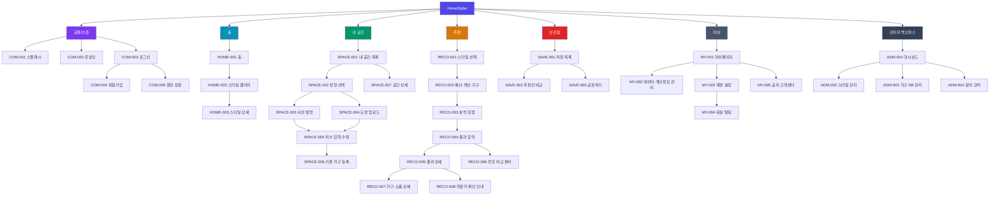

# HomeStyler(홈스타일러) 정보구조도 (IA)

## 메타

| 항목 | 내용 |
|------|------|
| 서비스명 | HomeStyler (홈스타일러) — AI 맞춤형 인테리어 추천 앱 |
| 플랫폼 | 모바일 앱 (iOS / Android) |
| 대상 사용자 | 인테리어 전문 지식이 없는 일반 성인 (거주 중 또는 이사 예정) |
| 핵심 도메인 | ① 공간 등록(사진/도면) ② 스타일·조건 설정 ③ AI 공간 분석 및 추천 ④ 전후 비교 시각화 ⑤ 저장·비교·공유 ⑥ 개인정보/이미지 보안 |
| 작성일 | 2026-07-19 |
| 버전 | v1.0 |

## 화면 목록

### 공통 / 인증 (COM)

| 화면ID | 화면명 | Depth | 상위화면 | 주요 콘텐츠 | 주요 기능 | 데이터 소스 | 접근권한 |
|--------|--------|-------|----------|-------------|-----------|-------------|----------|
| COM-001 | 스플래시 | 1 | - | 로고, 서비스 슬로건 | 자동 로그인 판별, 버전 체크 | Local | G |
| COM-002 | 온보딩 | 1 | COM-001 | 서비스 소개 3~4장 (촬영→스타일 선택→추천 확인 흐름), 개인정보 보호 안내 | 온보딩 넘기기, 건너뛰기 | Static | G |
| COM-003 | 로그인 | 1 | COM-001 | 소셜 로그인 버튼(카카오/Google), 이메일 로그인 | 소셜 로그인, 이메일 로그인, 비회원 둘러보기 진입 | API | G |
| COM-004 | 회원가입 | 2 | COM-003 | 이메일/비밀번호 입력 폼, 약관 목록(필수/선택), 이미지 데이터 처리 동의 | 회원가입, 약관 동의, 이메일 인증 | API | G |
| COM-005 | 권한 요청 안내 | 2 | COM-003 | 카메라/사진첩/알림 권한 설명 | 권한 허용/거부 | Static | G |

### 홈 탭 (HOME)

| 화면ID | 화면명 | Depth | 상위화면 | 주요 콘텐츠 | 주요 기능 | 데이터 소스 | 접근권한 |
|--------|--------|-------|----------|-------------|-----------|-------------|----------|
| HOME-001 | 홈 | 1 | - | 내 집 카드(등록된 공간 요약), "공간 분석 시작" CTA, 최근 추천 결과, 스타일 갤러리 미리보기 | 공간 등록 진입, 최근 결과 이어보기, 스타일 갤러리 탐색 | Mixed | G/U |
| HOME-002 | 스타일 갤러리 | 2 | HOME-001 | 스타일별(모던/미니멀/내추럴/북유럽/호텔식/우드톤) 레퍼런스 이미지, 스타일 설명 | 스타일 상세 보기, 관심 스타일 저장 | API | G/U |
| HOME-003 | 스타일 상세 | 3 | HOME-002 | 스타일 특징, 색상 팔레트, 대표 소재, 적용 예시 이미지 | 이 스타일로 분석 시작, 스크랩 | API | G/U |

### 내 공간 탭 (SPACE)

| 화면ID | 화면명 | Depth | 상위화면 | 주요 콘텐츠 | 주요 기능 | 데이터 소스 | 접근권한 |
|--------|--------|-------|----------|-------------|-----------|-------------|----------|
| SPACE-001 | 내 공간 목록 | 1 | - | 등록된 집/공간 카드(거실, 침실, 주방, 서재 등), 공간별 등록 상태 | 공간 추가, 공간 선택, 공간 삭제 | API | U |
| SPACE-002 | 공간 등록 - 유형 선택 | 2 | SPACE-001 | 공간 유형 선택(거실/침실/주방/서재/기타), 등록 방식 선택(사진 촬영/사진첩/도면 업로드) | 공간 유형 선택, 등록 방식 선택 | Static | U |
| SPACE-003 | 사진 촬영 가이드 | 3 | SPACE-002 | 촬영 각도·거리 가이드 오버레이, 예시 이미지, 채광 확인 팁 | 카메라 촬영, 재촬영, 다중 촬영(공간당 최대 10장) | Local | U |
| SPACE-004 | 도면 업로드 | 3 | SPACE-002 | 도면 이미지/PDF 업로드 영역, 도면 예시, 지원 형식 안내 | 파일 업로드, 도면 방향 회전, 미리보기 | Local/API | U |
| SPACE-005 | 치수 입력·수정 | 3 | SPACE-003, SPACE-004 | AI 추정 치수(가로/세로/천장고), 창문·문 위치, 신뢰도 표시, "추정치이며 실제와 다를 수 있음" 안내 | 치수 직접 입력/수정, 창문·문 위치 조정, 단위 변환(m/cm/평) | Mixed | U |
| SPACE-006 | 기존 가구 등록 | 3 | SPACE-005 | 사진에서 자동 인식된 가구 목록, 가구 유형·크기 | 유지할 가구 선택, 가구 정보 수정, 가구 수동 추가/제거 | Mixed | U |
| SPACE-007 | 공간 상세 | 2 | SPACE-001 | 공간 사진/도면, 치수 정보, 등록된 가구, 이 공간의 추천 이력 | 정보 수정, 재분석 요청, 공간 삭제(원본 포함) | API | U |

### 추천 탭 (RECO)

| 화면ID | 화면명 | Depth | 상위화면 | 주요 콘텐츠 | 주요 기능 | 데이터 소스 | 접근권한 |
|--------|--------|-------|----------|-------------|-----------|-------------|----------|
| RECO-001 | 조건 설정 - 스타일 | 2 | SPACE-006 | 스타일 카드(모던/미니멀/내추럴/북유럽/호텔식/우드톤), 복수 선택 가능(최대 3개) | 스타일 선택, 스타일 미리보기 | Static/API | U |
| RECO-002 | 조건 설정 - 예산·색상·가구 | 3 | RECO-001 | 예산 슬라이더(구간 선택), 선호 색상 팔레트, 필요한 가구 체크리스트, 유지 가구 확인 | 예산 설정, 색상 선택, 필요 가구 선택 | Static | U |
| RECO-003 | 분석 진행 | 3 | RECO-002 | 분석 진행률, 단계별 안내(구조 분석→채광 분석→동선 분석→추천 생성), 예상 소요 시간 | 분석 취소, 완료 시 푸시 알림 신청 | API | U |
| RECO-004 | 추천 결과 - 요약 | 2 | RECO-003 | 인테리어 콘셉트 요약, 전후 비교 대표 이미지, 스타일별 결과 탭 | 상세 결과 진입, 결과 저장, 공유 | API | U |
| RECO-005 | 추천 결과 - 상세 | 3 | RECO-004 | ① 콘셉트 설명 ② 가구 배치도·동선 ③ 벽지/바닥/조명/커튼 색상·소재 ④ 공간 확장 팁 ⑤ 수납 활용 ⑥ 기존 가구 배치안 ⑦ 예산별 추천 ⑧ 추천 가구·소품 목록 | 섹션별 탐색, 항목 스크랩, 가구 상세 보기 | API | U |
| RECO-006 | 전후 비교 뷰어 | 3 | RECO-004 | 현재 공간 사진 vs AI 시각화 이미지, 슬라이더 비교 | 슬라이더 드래그 비교, 이미지 확대, 이미지 저장 | API | U |
| RECO-007 | 추천 가구·소품 상세 | 4 | RECO-005 | 가구 이미지, 크기, 예상 가격대, 스타일 적합 이유, 배치 위치 | 위시리스트 추가, 유사 상품 보기 | API | U |
| RECO-008 | 전문가 확인 안내 | 3 | RECO-005 | 구조 변경·전기·배관·철거 관련 제안 목록, "전문가 확인 필요" 경고, 시공 범위 설명 | 안내 확인, 전문가 상담 연결(외부 링크) | Static/API | U |

### 보관함 탭 (SAVE)

| 화면ID | 화면명 | Depth | 상위화면 | 주요 콘텐츠 | 주요 기능 | 데이터 소스 | 접근권한 |
|--------|--------|-------|----------|-------------|-----------|-------------|----------|
| SAVE-001 | 저장된 추천 목록 | 1 | - | 저장된 추천 결과 카드(공간·스타일·날짜), 위시리스트 가구 | 결과 열기, 삭제, 비교 대상 선택(2~3개) | API | U |
| SAVE-002 | 추천안 비교 | 2 | SAVE-001 | 선택한 추천안의 스타일/예산/배치/색상 나란히 비교 | 비교 항목 전환, 최종 선택 표시 | API | U |
| SAVE-003 | 공유하기 | 2 | SAVE-001, RECO-004 | 공유 링크 생성, 공유 범위 설정(보기 전용), 링크 유효기간 | 카카오톡/링크 공유, 링크 만료 설정, 링크 회수 | API | U |

### 마이 탭 (MY)

| 화면ID | 화면명 | Depth | 상위화면 | 주요 콘텐츠 | 주요 기능 | 데이터 소스 | 접근권한 |
|--------|--------|-------|----------|-------------|-----------|-------------|----------|
| MY-001 | 마이페이지 | 1 | - | 프로필, 내 공간 수, 저장된 추천 수, 설정 메뉴 | 프로필 수정, 설정 진입 | API | U |
| MY-002 | 데이터·개인정보 관리 | 2 | MY-001 | 업로드한 사진/도면 목록, 저장 용량, 데이터 보관 정책 안내 | 원본 사진/도면 개별·일괄 삭제, 분석 결과만 남기고 원본 삭제, 전체 데이터 다운로드 | API | U |
| MY-003 | 계정 설정 | 2 | MY-001 | 알림 설정, 비밀번호 변경, 연결된 소셜 계정 | 알림 on/off, 계정 정보 수정 | API | U |
| MY-004 | 회원 탈퇴 | 3 | MY-003 | 탈퇴 시 삭제되는 데이터 안내(사진·도면·추천 결과 전체) | 탈퇴 사유 선택, 탈퇴 확정(모든 데이터 즉시 삭제) | API | U |
| MY-005 | 공지·고객센터 | 2 | MY-001 | 공지사항, FAQ, 1:1 문의 | 문의 등록, FAQ 검색 | API | G/U |

### 관리자 (ADM) — 별도 웹 백오피스

| 화면ID | 화면명 | Depth | 상위화면 | 주요 콘텐츠 | 주요 기능 | 데이터 소스 | 접근권한 |
|--------|--------|-------|----------|-------------|-----------|-------------|----------|
| ADM-001 | 관리자 대시보드 | 1 | - | 가입자/분석 요청 수, AI 분석 성공률, 오류 현황 | 지표 조회 | API | A |
| ADM-002 | 스타일 콘텐츠 관리 | 2 | ADM-001 | 스타일 정의, 레퍼런스 이미지, 색상 팔레트 | 스타일 등록/수정, 이미지 관리 | API | A |
| ADM-003 | 가구 DB 관리 | 2 | ADM-001 | 추천 가구 데이터(카테고리, 크기, 가격대, 스타일 태그) | 가구 등록/수정/삭제 | API | A |
| ADM-004 | 문의·신고 관리 | 2 | ADM-001 | 1:1 문의 목록, 처리 상태 | 답변 등록, 상태 변경 | API | A |

## 계층 다이어그램



## 핵심 사용자 흐름 (Happy Path)

```
공간 등록: SPACE-002 유형 선택 → SPACE-003 사진 촬영(또는 SPACE-004 도면) → SPACE-005 치수 확인·수정 → SPACE-006 기존 가구 선택
추천 흐름: RECO-001 스타일 선택 → RECO-002 예산·색상·가구 → RECO-003 분석 → RECO-004 결과 요약 → RECO-006 전후 비교 / RECO-005 상세
활용 흐름: SAVE-001 저장 → SAVE-002 비교 → SAVE-003 가족·업체 공유
```

## IA 설계 노트

- **비회원(G) 허용 범위**: 홈·스타일 갤러리 탐색까지만 허용. 사진 업로드는 개인 공간 데이터를 다루므로 회원 전용(U).
- **치수 입력(SPACE-005)을 독립 화면으로 분리**: AI 추정치의 한계를 보완하고 "추정치 ≠ 실측치" 인지를 명확히 하기 위한 핵심 신뢰 장치.
- **전문가 확인 안내(RECO-008)를 별도 화면으로 분리**: 구조 변경/전기/배관/철거 제안은 반드시 경고와 함께 격리 노출.
- **데이터·개인정보 관리(MY-002)를 1뎁스 접근 가능한 메뉴로 배치**: 원본 삭제권을 쉽게 행사할 수 있어야 신뢰 확보 가능.
